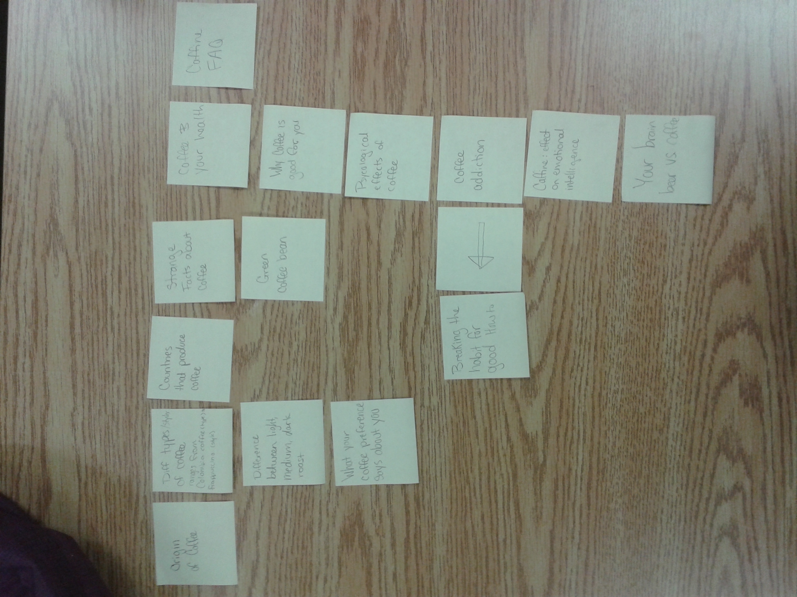
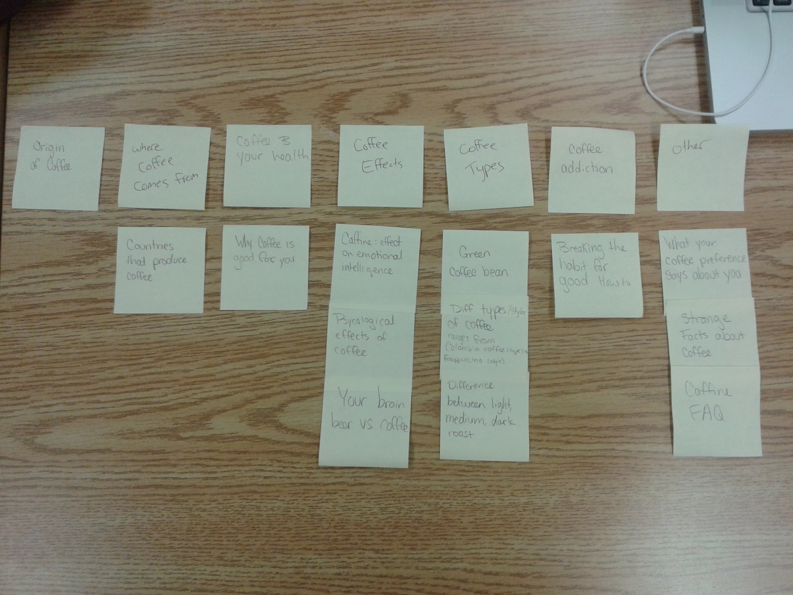

# Card sort report

The purpose of this card sort was to determine common navigation patterns and categories from the content of Coffee.

## Specifics

The card sort was conducted by Grace Morton on Sept. 10th 2013 between the times of 3PM and 6PM with the following participants:

- Lisa Villeneuve 
- Kayla Tuor

### Cards

15 cards were used covering a broad range of applicable content for the website. The following topics were used as cards:

1.	Origin of Coffee	
2.	Countries that produce coffee	
3.	Difference between light, medium and dark roast
4.	Psychological effects of coffee	
5.	Coffee and your health	
6.	These 10 Facts About Coffee Will Blow Your Mind
7.	Green coffee bean	
8.	Diff types of coffee	
9.	Coffee addiction	
10.	Breaking the habit for good	
11.	Caffine: The Silent Killer of Emotional Intelligence
12.	What do your Coffee Preferences Say About You? 
13. Your Brain on Beer vs. Coffee	
14.	7 Reasons Why Coffee is Good for You	
15. Caffine FAQ	

## Card sort results

*Card sort 1 by Lisa Villeneuve*

*Card sort 2 by Kayla Tuor*

## Observations

- Did the participants have any common comments?
	- I don't recall any comments being made. They just went at it.
- Did they have questions that stood out?
	- They didn't actually ask any questions, they seemed to understand the topics in front of them.
- Did they struggle with certain articles or topics?
	- I noticed that neither of them put anything under the *Origin of Coffee* header. 
	- I also noticed that *Card Slot 2* created their own header to put *Countries that produce Coffee*, while *Card Slot 1* created that as a header with nothing in that group. I would have group those 2 topics together.
- Did they find common groupings? Or were the groupings completely different?
	- Some of the headers were different. For example, *Caffine FAQ* was used as a header in Card Slot 1; however it was placed under header *Other* in Card slot 2.
- Were some of the groupings completely unexpected?
 	- I was surpised that "Green Coffee Bean" was placed under the header *Strange Facts about Coffee.* I thought it would go under *Different Types of Coffee.*
 	- I was also surpised that there was no content under *Origin of Coffee* in Card Slot 1, because I would have placed *Countries that produce Coffee* in that header, instead of making both of those headers and not puting anything in them. 
 	- Lastly I was suprised with *Card Slot 1* putting *What your coffee preference says about you* under *Different types of Coffee* header when I would have placed that under *Strange Facts about Coffee.*
- Were the results similar to your expectations?
	- Results from *Card Slot 2* were more similar to my expectations. I would make changes to the organization of *Card Slot 1.*
- How did you feel while watching them perform the task?
	- Honestly king of relieved because I wasn't too sure myself where everything would be best organized and I liked seeing different perspectives from different people. 